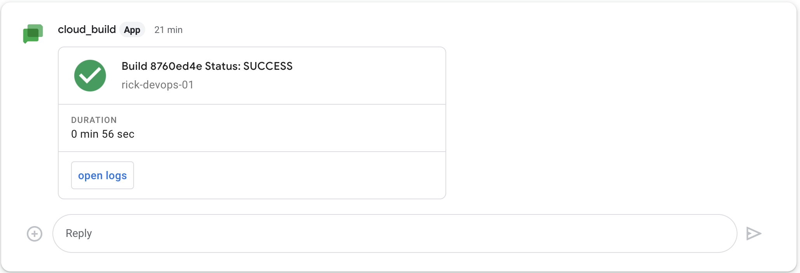

# cloudbuild-chat-notification
Cloud Build can notify you of build updates by sending you notifications to desired channels, such as Slack or your SMTP server. This sample shows how to configure notifications using the Google Chat notifier.
## key components:
- Cloud Run service
- Pub/Sub

# Usage Instructions

1.
Get webhook of google chat space, by following step 1 from 
[Create webhook](https://developers.google.com/chat/how-tos/webhooks#create_a_webhook)

2.
Go to cloud shell, run the following commands
```shellcript
cd $HOME
git https://github.com/rick-c-goog/cloudbuild-chat-notification.git
cd cloudbuild-chat-notification/
chmod +x script.sh
```

Update file script.sh, 
export TF_VAR_chat_space_webhook="XXXXXX"
replace the chat space webhook copied from step 1

3. Provision Google chat notification components through terraform
```shellcript
cd $HOME
cd cloudbuild-chat-notification/
./script.sh
```

4. Test cloud build example
```shellcript
cd $HOME
cd cloudbuild-chat-notification/cloudbuild
gcloud builds submit --region=us-east1
```
If the cloud build commands completed successfully, you will got an notification in Google chat space with message:
 [](./image/chat-nofitication-screenshot.png) 


